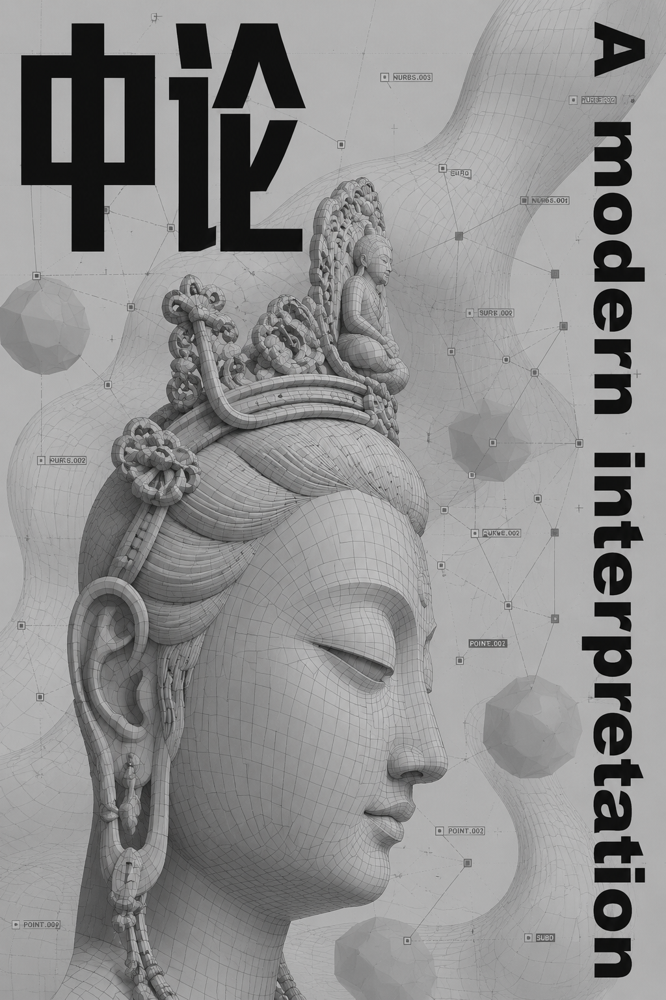

# 《中论现代性解读》| Modern Interpretation of *Mūlamadhyamakakārikā*



> 龙树《中论》的后人类主义跨学科哲学重构
> A Posthumanist Interdisciplinary Philosophical Reconstruction of Nāgārjuna's *Madhyamaka*

---

## 关于作者 | About the Author


**chino mana -千野 真名**

> 我是一名高中生，对哲学和佛学有浓厚的兴趣。这个项目源于我阅读龙树《中论》时的困惑——古老的翻译和繁杂的评注让现代人难以接近这部伟大的哲学著作。我希望用当代哲学的语言，让更多人能够接触到龙树的智慧。
>
> I'm a high school student with a deep interest in philosophy and Buddhist thought. This project grew out of my frustration reading Nāgārjuna's *Mūlamadhyamakakārikā* — the archaic translation and dense commentaries make this great philosophical work inaccessible to modern readers. I hope to bring Nāgārjuna's wisdom to more people through the language of contemporary philosophy.

> ⚠️ **关于维护 | About Maintenance**：由于我还是高中生，学业繁忙，GitHub 操作也不太熟练，仓库的维护可能不够及时。如果发现任何问题，请多多包涵，也欢迎通过 Issue 联系我！
>
> ⚠️ **Note on Maintenance**: As a high school student with limited experience on GitHub, I may not be able to maintain this repository as promptly as I'd like. Please bear with me, and feel free to reach out via Issues!

---

## 这是什么？| What Is This?

这本书是对古代印度哲学家 **龙树菩萨**（约公元150-250年）所著《中论》的全面现代解读。

This book is a comprehensive modern interpretation of the *Mūlamadhyamakakārikā* (Fundamental Verses on the Middle Way) by the ancient Indian philosopher **Nāgārjuna** (c. 150–250 CE).

《中论》是佛教哲学最深奥的著作之一，提出了一切事物"空性"的论证。但由于原文是古汉译（鸠摩罗什译，公元5世纪），且夹杂着大量评注，现代人很难读懂。

The *Mūlamadhyamakakārikā* is one of the most profound works in Buddhist philosophy, presenting arguments for the "emptiness" (śūnyatā) of all phenomena. However, the existing Chinese translation by Kumārajīva (5th century) is interwoven with extensive commentaries that make it difficult for contemporary readers to access.

**本项目做了三件事：| This project does three things:**

1. **提取纯净原文 | Extracting Pure Original Text** —— 去除了鸠摩罗什和青目的评注，只保留龙树本人的偈颂 / Removing the commentaries by Kumārajīva and Piṅgala, preserving only Nāgārjuna's own verses
2. **现代化逐句翻译 | Modern Line-by-Line Translation** —— 用现代汉语重新翻译，还原龙树的论证逻辑 / Re-translating into modern Chinese to reconstruct Nāgārjuna's argumentative logic
3. **跨学科哲学解读 | Interdisciplinary Philosophical Interpretation** —— 每一章都与当代哲学进行深度对话（Deleuze、拉鲁埃、系统论、神经科学等）/ Each chapter engages in dialogue with contemporary philosophy (Deleuze, Laruelle, systems theory, neuroscience, etc.)

---

## 阅读方式 | How to Read

| 方式 | Format | 链接 | Link | 适合场景 | Best For |
|------|--------|------|------|----------|----------|
| 在线阅读（GitHub Pages）| Online (GitHub Pages) | [点击阅读](https://chinomana.github.io/zhonglun-modern/) | [Read](https://chinomana.github.io/zhonglun-modern/) | 电脑/手机浏览 | Browser reading |
| 在线阅读（Markdown）| Online (Markdown) | [点击阅读](zhonglun-modern.md) | [Read](zhonglun-modern.md) | 直接浏览完整 Markdown | Quick preview |
| 下载 EPUB | Download EPUB | [点击下载](zhonglun-modern.epub) | [Download](zhonglun-modern.epub) | iPad / Kindle / 微信读书 | E-readers |
| 下载 PDF | Download PDF | [点击下载](zhonglun-modern.pdf) | [Download](zhonglun-modern.pdf) | 打印/学术引用 | Print / Academic citation |

> 💡 **提示 | Note**：GitHub Pages 线上阅读需要你在 GitHub 仓库设置中手动开启（Settings → Pages → Source 选择 main 分支）。在开启之前，可以直接点击「Markdown」链接在 GitHub 上浏览完整内容。
>
> 💡 **Note**: GitHub Pages requires manual activation in your repository settings (Settings → Pages → Source: main branch). Until then, use the Markdown link for direct browsing.

---

## 全书27章一览 | Table of Contents (27 Chapters)

全书统一站在 **后人类主义（Posthumanism）** 的哲学立场上，每章选取不同的跨学科视角与龙树对话。

The entire book adopts a unified **posthumanist** philosophical stance, with each chapter selecting a different interdisciplinary perspective to engage with Nāgārjuna.

| 章节 Ch. | 品名 Chinese Title | 对话领域 Field of Dialogue |
|:--------:|-------------------|---------------------------|
| 第1章 Ch.1 | 观因缘品 *Examination of Conditions* | 康德批判、休谟怀疑论 Kantian critique, Humean skepticism |
| 第2章 Ch.2 | 观去来品 *Examination of Coming and Going* | 海德格尔时间分析、德里达 Heidegger, Derrida |
| 第3章 Ch.3 | 观六情品 *Examination of the Sense Bases* | 梅洛-庞蒂身体现象学 Merleau-Ponty |
| 第4章 Ch.4 | 观五阴品 *Examination of the Aggregates* | 福柯主体性批判 Foucault |
| 第5章 Ch.5 | 观六种品 *Examination of the Elements* | 新唯物主义 New Materialism (Barad/Bennett) |
| 第6章 Ch.6 | 观染染者品 *Examination of Defilement and the Defiled* | Deleuze-Guattari 欲望机器 desiring-machines |
| 第7章 Ch.7 | 观三相品 *Examination of the Three Marks* | 怀特海过程哲学 Whitehead's process philosophy |
| 第8章 Ch.8 | 观作作者品 *Examination of Agent and Action* | 行动者-网络理论 Actor-Network Theory |
| 第9章 Ch.9 | 观本住品 *Examination of the Self* | Metzinger 自我模型理论 self-model theory |
| 第10章 Ch.10 | 观然可然品 *Examination of Fire and Fuel* | 解域化 / 关系本体论 deterritorialization |
| 第11章 Ch.11 | 观本际品 *Examination of Beginning and End* | Laruelle 非哲学 non-philosophy |
| 第12章 Ch.12 | 观苦品 *Examination of Suffering* | 非哲学伦理学 non-philosophical ethics |
| 第13章 Ch.13 | 观行品 *Examination of Conditioned Phenomena* | 鲍德里亚拟像理论 Baudrillard's simulacra |
| 第14章 Ch.14 | 观合品 *Examination of Combination* | 对象导向本体论 OOO |
| 第15章 Ch.15 | 观有无品 *Examination of Being and Non-Being* | 激进虚无主义 Brassier's nihilism |
| 第16章 Ch.16 | 观缚解品 *Examination of Bondage and Liberation* | 二阶控制论 second-order cybernetics |
| 第17章 Ch.17 | 观业品 *Examination of Action (Karma)* | 信息论 / 复杂系统 information theory |
| 第18章 Ch.18 | 观法品 *Examination of Phenomena* | 自创生系统论 autopoiesis |
| 第19章 Ch.19 | 观时品 *Examination of Time* | 控制论时间观 cybernetic temporality |
| 第20章 Ch.20 | 观因果品 *Examination of Cause and Effect* | 系统论因果观 systems-theoretic causality |
| 第21章 Ch.21 | 观成坏品 *Examination of Arising and Decay* | 预测加工理论 predictive processing |
| 第22章 Ch.22 | 观如来品 *Examination of the Tathāgata* | 意识科学 consciousness science |
| 第23章 Ch.23 | 观颠倒品 *Examination of Errors* | 精神疾病预测加工 psychopathology |
| 第24章 Ch.24 | 观四谛品 *Examination of the Noble Truths* | 自由能原理 Friston's Free Energy Principle |
| 第25章 Ch.25 | 观涅槃品 *Examination of Nirvāṇa* | 意识研究 consciousness studies |
| 第26章 Ch.26 | 观十二因缘品 *Examination of Dependent Origination* | 萨满教 / 原始宗教 shamanism / comparative religion |
| 第27章 Ch.27 | 观邪见品 *Examination of Wrong Views* | 世界文化对比 cross-cultural comparison |

---

## 核心哲学立场：后人类主义 | Core Stance: Posthumanism

这不是一本"佛教入门书"，也不是传统的佛学注解。

This is not a "Buddhism for beginners" book, nor a traditional philological commentary.

本书将龙树的《中论》视为一种 **跨文化的哲学操作工具**——它能够从内部瓦解笛卡尔-康德传统的主体性神话，与当代后人类主义形成深层共鸣。

This book treats Nāgārjuna's *Mūlamadhyamakakārikā* as a **cross-cultural philosophical instrument**—one capable of dismantling the Cartesian-Kantian myth of subjectivity from within, resonating deeply with contemporary posthumanism.

> "以有空义故，一切法得成；若无空义者，一切则不成。"
> —— 龙树《中论》第24章
>
> "It is because of emptiness that all things are possible; if all things were not empty, nothing would be possible."
> —— Nāgārjuna, *Mūlamadhyamakakārikā* Ch.24

---

## 版权声明 | License

- **龙树原文 | Nāgārjuna's original text**（公元150-250年 / c. 150–250 CE）：公共领域 Public Domain
- **鸠摩罗什译本 | Kumārajīva's translation**（公元344-413年 / 344–413 CE）：公共领域 Public Domain
- **现代解读、翻译、论述 | Modern interpretation, translation, and commentary**：本项目原创 Original to this project，采用 **CC BY-NC-SA 4.0** 许可
  - ✅ 允许 Permitted：分享 Share、改编 Adapt、学术引用 Academic cite
  - ❗ 要求 Requires：署名 Attribution、非商业用途 Non-commercial、相同方式共享 ShareAlike
  - 详见 See [LICENSE-CC-BY-NC-SA-4.0](LICENSE-CC-BY-NC-SA-4.0)

---

## 参与贡献 | Contributing

发现了错别字？有哲学观点想补充？想参与英文翻译？

Found a typo? Want to add a philosophical point? Interested in contributing to the English translation?

非常欢迎！请查看 Please check out [CONTRIBUTING.md](CONTRIBUTING.md)（中文）和 and [TRANSLATION.md](TRANSLATION.md)（翻译指南 / translation guide）。

---

## 学术引用 | Citation

### 中文格式 Chinese Format
```
《中论现代性解读：龙树中观的后人类主义跨学科哲学重构》，
GitHub 开源项目，2026。
https://github.com/chinomana/zhonglun-modern
```

### English Format (MLA)
```
Modern Interpretation of Mūlamadhyamakakārikā: 
A Posthumanist Interdisciplinary Reconstruction of Nāgārjuna's Madhyamaka. 
GitHub, 2026, https://github.com/chinomana/zhonglun-modern.
```

### BibTeX
```bibtex
@book{zhonglun2026,
  title={中论现代性解读：龙树中观的跨学科哲学重构},
  titleaddon={Modern Interpretation of Mūlamadhyamakakārikā},
  author={chino mana - 千野 真名},
  year={2026},
  url={https://github.com/chinomana/zhonglun-modern},
  note={Open source philosophical commentary by a high school student}
}
```

---

*本书为持续更新项目，内容可能随时修订。*
*This book is a living document and may be revised at any time.*
